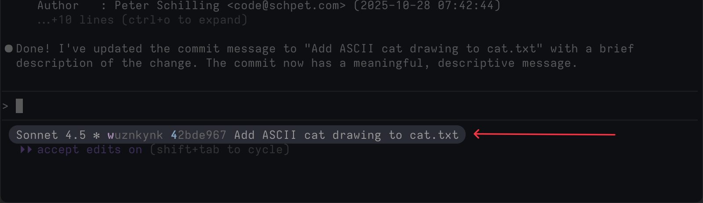

# jjagent

jjagent is a claude code plugin and program that uses hooks to associate a claude session change to it's own commit. this makes isolating the edits from you and other claude sessions easy.

this differs from having claude commit many times: there's a single, [changing commit](https://jj-vcs.github.io/jj/latest/glossary/#change) that you iterate on in a claude session. it's only split into another commit when a conflict would be detected or it is split by a user command.

it also differs from git worktree style systems: you and claude are working on the same working copy. this allows you to prevent conflicts, and for all the claude sessions to be in sync with each others changes. this may or may not be desirable, and you can use jjagent within jj workspaces to make separate branches of work.

the state is kept in the commit messages: a `Claude-sessions-id` trailer informs where jjagent will squash the claude session changes into, and also allows you to easily resume a claude session in the future.


## how it works

when you start, `@` is at the head. lets call `@` 'users working copy' given its where you, the user works. you can change things while claude works away in the background and your changes will be here.

when a claude session is started and `PreToolUse` fires, jjagent will make a new change – a descendant of the users working copy. this is a fresh change for claude's changes to live in. after claude is done changing files, the `PostToolUse` fires and jjagent will squash those changes into a new direct ancestor of the users working copy. jj automatically rebases the descendants during the squash, and `@` is back to the users working copy. subsequent claude edit tool calls will find the session's change based on a Claude-session-id trailer in the change description.

multiple claude sessions can be going at one, a lock file is used to have them wait their turn before editing files.

it's attribution is not perfect: you might write a file while we're on a claude change, and claude might use bash to change stuff. room for improvement here! but it works well for me.

## assumptions, constraints, limitations

- you need to keep `@` as a descendent of claude's changes, the assumed workflow is that you will be working at the [head](https://jj-vcs.github.io/jj/latest/glossary/#head) or tip of descendants. if you move `@` backwards while claude is doing its thing you are in for a bad time: claude will branch or otherwise do things on wrong assumptions
- assumes you're running claude with 'accept edits on' or 'bypass permissions on'
- when claude is editing files, avoid running jj commands that might have side effects. make sure to use `--ignore-wroking-copy` to prevent that
- avoid running `jj describe` interactively: if claude code edits a file while you have your describe editor open you'll run into 'Error: The "@" expression resolved to more than one operation'
- jjagent is currently only able to properly attribute changes from the `Edit|MultiEdit|Write` claude code tools, claude often changes files with bash and jjagent doesn't try to track that
- right now, jjagent is coupled very tightly to claude code. hopefully other agents (codex cli, gemini cli, et al) support hooks similar to claude code in the future and can be supported.

## installation

<details>
<summary>homebrew</summary>

```bash
brew install schpet/tap/jjagent
```

</details>

<details>
<summary>binaries</summary>

https://github.com/schpet/jjagent/releases/latest

</details>

<details>
<summary>from source</summary>

```bash
# clone jj agent locally
cargo install --path .
```

</details>

## setup

### via claude code plugin (recommended)

1. add the marketplace and install the plugin:
   ```bash
   /plugin marketplace add schpet/jjagent
   /plugin install jjagent@jjagent
   ```
1. restart claude code
1. use claude code normally in a jj repo - jjagent runs automatically via hooks


> [!NOTE]
> if you don't have the `/plugin` command you are likely running an old version of claude code. ensure you're on version 2.0.19 or later

### via settings (fallback)

1. update ~/.claude/settings.json with the json this command dumps out:
   ```bash
   jjagent claude settings
   ```
2. use claude code normally in a jj repo - jjagent runs automatically via hooks

### status line integration (optional, recommended)

jjagent can display your current session's jj change in [claude code's status line](https://docs.claude.com/en/docs/claude-code/statusline). this gives you visibility into what commit your edits are being tracked in.



<details>
<summary>setup instructions</summary>

1. create a status line script (e.g. `~/.claude/statusline.sh`):
   ```bash
   #!/bin/bash
   input=$(cat)
   model=$(echo "$input" | jq -r '.model.display_name')
   jj_info=$(echo "$input" | jjagent claude statusline 2>/dev/null)
   printf "%s ✻%s" "$model" "${jj_info:+ $jj_info}"
   ```

2. make it executable:
   ```bash
   chmod +x ~/.claude/statusline.sh
   ```

3. configure it in `~/.claude/settings.json`:
   ```json
   {
     "statusline": {
       "command": "~/.claude/statusline.sh"
     }
   }
   ```

4. restart claude code to see your status line:
   ```
   Sonnet 4.5 ✻ qxtqxkqq 602f8f0e Add feature
   ```

> [!TIP]
> For more statusline customization options, see the [Claude Code statusline docs](https://docs.claude.com/en/docs/claude-code/statusline)

</details>

## plugin features

the jjagent plugin provides additional commands and agents for working with session changes:

**prerequisites:** you must have jjagent installed (see [installation](#installation)) before installing the plugin. the plugin just sets up hooks and provides convenience commands - the actual jjagent binary does the heavy lifting.

### slash commands

- `/jjagent:describe "example message...` - describe this session's change with a provided message
- `/jjagent:describe` - generate a message based on the diff
- `/jjagent:insert-after` - create a new change after a specific ref where this session's edits will live, if you already have a change for this session it'll help rebase it after this ref
- `/jjagent:into` - mark an existing change to squash this session's edits into
- `/jjagent:split` - split future edits into a new change

### hooks

_fyi: these are setup by the plugin automatically_

the plugin automatically configures these hooks:
- `SessionStart` - injects session ID into claude's context at the start of each session to support slash commands
- `UserPromptSubmit` - re-injects session ID if it's been lost from recent context (i.e. compact)
- `PreToolUse` / `PostToolUse` - manages session changes around file edits (edit, write tools)
- `Stop` - cleanup when claude session ends

## resuming sessions

you can resume any previous claude session using the `session-id` command. this extracts the Claude session ID from a jj revision's trailer:

```bash
# resume a session from any jj revision (change ID, bookmark, @-, etc.)
claude -r $(jjagent session-id <jj-ref>)

# examples:
claude -r $(jjagent session-id @-)     # resume session from parent commit
claude -r $(jjagent session-id abc123) # resume session from specific change ID
```

the inverse command `change-id` finds the jj change for a given session:

```bash
# find the jj change ID for a claude session
jjagent change-id <session-id>
```

## mood board

> You see, jj was designed around a single feature requirement. That requirement led to a very simple design addition to Git's DVCS model, that naturally enabled all of the features:
>
> jj was designed to support concurrency.

– [Jujutsu is great for the wrong reason](https://www.felesatra.moe/blog/2024/12/23/jj-is-great-for-the-wrong-reason)

## acknowledgements

inspired directly by [gitbutler's claude code hooks](https://docs.gitbutler.com/features/ai-integration/claude-code-hooks)
